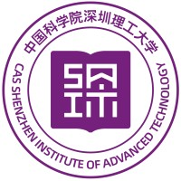
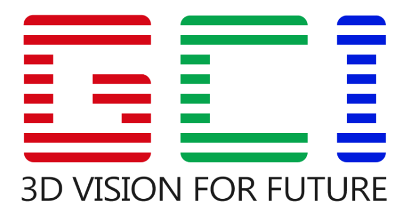
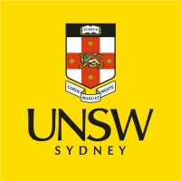
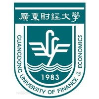

## About Me 🚀
Hello guys😃, welcome to my homepage. I'm Xuanzhi Liu. I'm pursuing my Master's degree in UNSW Sydney, Australia. My research mainly focus on Machine Vision algorithms and their applications in industry. In my spare time, I'm good at cooking🧑‍🍳 and singing pop-music🎵. My MBTI is ESFJ. 

📢📢 <strong> I'm looking for a RA/Ph.D position, please drop me an email if you are recruiting.</strong>

## Research Interests 🔥
During SIAT work, my research mainly focus on **Robotics Grasping Tasks🤖** and **Machine Vision👀**, under the supervision of [Prof. Zhan Song](http://english.siat.cas.cn/SI2017/IAIT2017/RC1/CPE_20529/). Meanwhile, as a Master's student at UNSW Sydney, I also do some works on **Static Analysis** and **Graph Algorithm** under the supervision of [Dr. Zhengyi Yang](http://www.zhengyi.one/).  
  
## Experiences 🌏

<h4 style="margin:0 10px 0;">Research Center for Machine Vision, SIAT</h4>
<ul style="margin:0 0 5px;">
  <autocolor>Dec.2024 ~ Present, on-site </autocolor>
  <autocolor>Research Assistant </autocolor>
  <autocolor>Topics: Machine Vision, High precise Robotics Grasping Tasks </autocolor>
  <autocolor>Supervisor: Prof. <a href="http://english.siat.cas.cn/SI2017/IAIT2017/RC1/CPE_20529/">Zhan Song</a></autocolor>  
</ul>

<h4 style="margin:0 10px 0;">Research Center for Machine Vision, SIAT</h4>
<ul style="margin:0 0 5px;">
  <autocolor>June.2022 ~ April.2023, 10 months, on-site </autocolor>
  <autocolor>Visiting Student </autocolor>
  <autocolor>Topics: 3D Vision, Robotics Grasping Tasks in industry </autocolor>
  <autocolor>Supervisor: Prof. <a href="http://english.siat.cas.cn/SI2017/IAIT2017/RC1/CPE_20529/">Zhan Song</a></autocolor>  
</ul>

<h4 style="margin:0 10px 0;">Shenzhen Guangcheng Innovation Technology Co., Ltd.  </h4>
<ul style="margin:0 0 5px;">
  <autocolor>Oct.2022 ~ Feb.2023, 5 months, hybrid </autocolor>
  <autocolor>3D Vision Intern </autocolor>
</ul>

## Education 🏫

<h4 style="margin:0 10px 0;">UNSW Sydney</h4>
<ul style="margin:0 0 5px;">
  <autocolor>Sep.2023 ~ Aug.2025 (expected) </autocolor>
  <autocolor>M.S. of Information Technology </autocolor>
</ul>

  <h4 style="margin:0 10px 0;">Guangdong University of Finance & Economics</h4>

<ul style="margin:0 0 5px;">
  <autocolor>Sep.2019 ~ June.2023 </autocolor>
  <autocolor>B.S. of Computer Science </autocolor>
</ul>




## Patents 🧰

  <h4 style="margin:0 10px 0;">Automatic Visual Recognition Method and Sorting System</h4>
  <ul style="margin:0 0 5px;">
    <autocolor><strong>[CN116213306A]</strong> <a href="http://epub.cnipa.gov.cn/patent/CN116213306A">Patent Link</a> </autocolor>
  </ul>

## Awards 🥇

  <h4 style="margin:0 10px 0;">Outstanding Thesis Award</h4>
  <ul style="margin:0 0 5px;">
    <autocolor><strong>[Top 1% of the University]</strong> From Guangdong University of Finance & Economics</autocolor>
  </ul>

## Learning Notes ✍️
[Static Analysis](https://zhuanlan.zhihu.com/p/681560790)  
[Neuron Network: Forward Propagation](https://blog.csdn.net/debby233/article/details/126364933?spm=1001.2014.3001.5502)  
[Neuron Network: Backward Propagation](https://blog.csdn.net/debby233/article/details/126426619?spm=1001.2014.3001.5502)  
[Semantic Segmentation: Create your dataset and implement U-Net](https://blog.csdn.net/debby233/article/details/125973500?spm=1001.2014.3001.5502)  
[Semantic Segmentation: User guide of Augmentor](https://blog.csdn.net/debby233/article/details/126059940?spm=1001.2014.3001.5502)  
[Semantic Segmentation: Copy_Paste Augmentation](https://blog.csdn.net/debby233/article/details/126100085?spm=1001.2014.3001.5502)  
[Semantic Segmentation: Progress of implementing a project](https://blog.csdn.net/debby233/article/details/126221264?spm=1001.2014.3001.5502)  
[Object Detection: Data Augmentation](https://blog.csdn.net/debby233/article/details/126016717?spm=1001.2014.3001.5502)  
[Object Detection: Make your dataset](https://blog.csdn.net/debby233/article/details/125875361?spm=1001.2014.3001.5502)  

